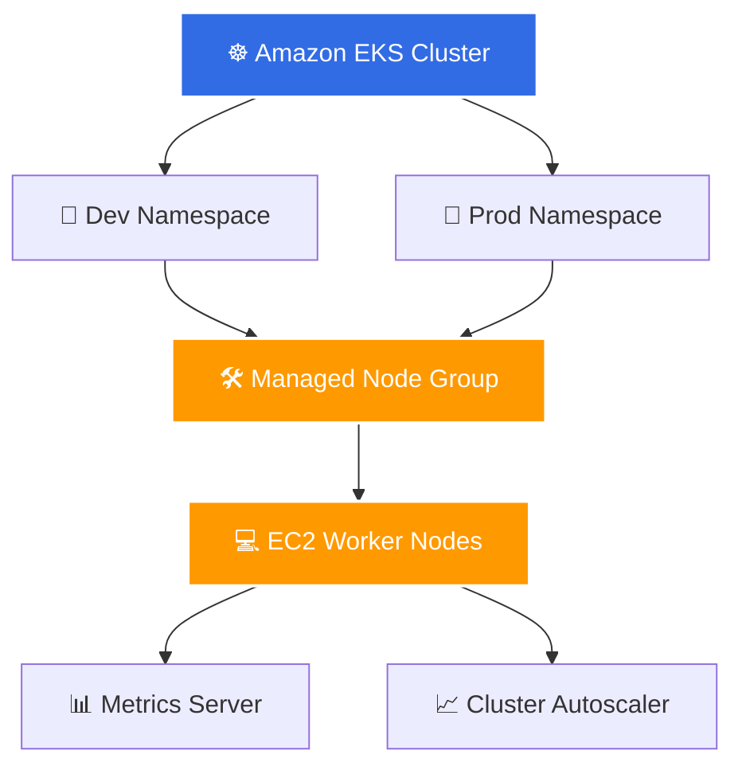

# Exercise 16: Build a Production EKS Platform


## 🎯 Objective

Create a production-ready Amazon EKS cluster using **Terraform** and **Terragrunt** featuring:

- **EKS Control Plane** with automated management
- **Managed Node Groups** for compute reliability
- **Dev & Prod Namespaces** for environment segregation
- **Cluster Autoscaler** for dynamic horizontal scaling
- **Metrics Server** for resource utilization monitoring

---

## 🏗️ Architecture

This setup is visualized below using a responsive Mermaid architecture diagram natively supported by GitHub:



---

## 🛠️ Technologies Used

| Technology | Purpose |
| :--- | :--- |
| **AWS IAM** | Secure role-based access control and policy mapping |
| **Amazon EKS** | Managed Kubernetes control plane |
| **Terraform & Terragrunt** | Infrastructure as Code (IaC) and DRY module orchestrations |
| **Metrics Server** | Container resource metrics collector |
| **Cluster Autoscaler** | Automatic node group scaling based on pending pods |

---

## 🚦 Validation & Testing

Verify your deployment and inspect cluster resources by running the following commands:

```bash
# Get all worker nodes in the cluster
kubectl get nodes

# View resource utilization (CPU/Memory) of the nodes
kubectl top nodes

# Verify environment segregation namespaces
kubectl get ns
```

### 📋 Sample Verification Output

<details>
<summary>🔍 Click to view sample terminal outputs</summary>

**Node Status (`kubectl get nodes`):**
```text
NAME                            STATUS   VERSION
ip-172-31-1-178.ec2.internal    Ready    v1.28.x
ip-172-31-39-230.ec2.internal   Ready    v1.28.x
```

**Node Metrics (`kubectl top nodes`):**
```text
NAME                            CPU(cores)   MEMORY(bytes)
ip-172-31-1-178.ec2.internal    19m          376Mi
ip-172-31-39-230.ec2.internal   30m          359Mi
```

**Namespace Segregation (`kubectl get ns`):**
```text
NAME              STATUS   AGE
default           Active   10m
dev               Active   9m
prod              Active   9m
kube-system       Active   10m
```
</details>
