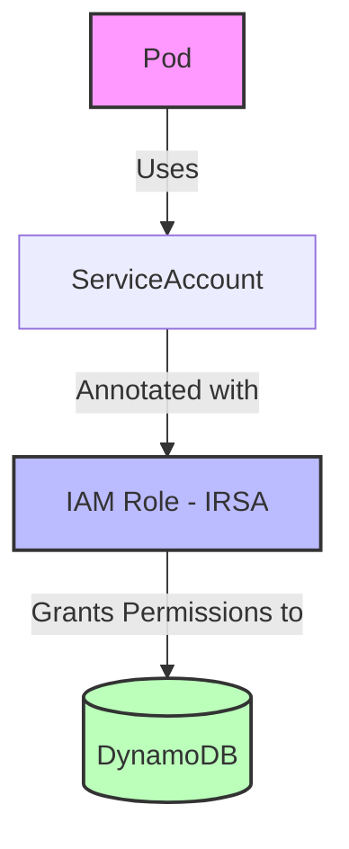

# Exercise 2 – IAM / IRSA Failure

## Incident Overview
The application suddenly cannot read from DynamoDB.

### Application Logs
```text
2026-05-10T08:12:13Z ERROR
botocore.exceptions.ClientError:
An error occurred (AccessDeniedException) when calling the GetItem operation:
User: arn:aws:sts::123456789012:assumed-role/eks-nodegroup-role is not authorized to perform:
dynamodb:GetItem on resource: arn:aws:dynamodb:ap-south-1:123456789012:table/customer-data
```

### Current Architecture


```text
Pod 
 ↓
ServiceAccount (Annotated with IAM Role ARN)
 ↓
IAM Role (Assumed via OIDC / IRSA)
 ↓
DynamoDB (Allowed Actions)
```

---

## Tasks & Diagnosis

### 1. Why is the Node Role being used?
The AWS SDK (e.g., Python's `boto3` / `botocore`) resolves credentials using a default **Credential Provider Chain**. The SDK checks credentials in the following order:
1. **Explicit Session Credentials**: Hardcoded or explicitly passed `aws_access_key_id`/`aws_secret_access_key`.
2. **Environment Variables**: `AWS_ACCESS_KEY_ID` and `AWS_SECRET_ACCESS_KEY`.
3. **Web Identity Token (IRSA)**: Looks for environment variables `AWS_ROLE_ARN` and `AWS_WEB_IDENTITY_TOKEN_FILE` (which are automatically injected by the EKS Pod Identity Webhook if IRSA is correctly configured).
4. **Shared Credentials/Config Files**: (e.g. `~/.aws/credentials`).
5. **EC2 Instance Metadata Service (IMDS)**: Queries the EKS worker node's instance profile (`eks-nodegroup-role`).

Because the SDK output shows it is attempting to call DynamoDB as `arn:aws:sts::123456789012:assumed-role/eks-nodegroup-role`, it means the **Web Identity Token (IRSA) provider failed or was bypassed**, causing the credentials chain to fall back to the last step (IMDS Node Instance Profile).

---

### 2. Why is IRSA not working?
IRSA can fail due to several configuration errors at different layers of EKS and AWS IAM:
* **Missing ServiceAccount on Pod**: The Pod's manifest does not specify `spec.serviceAccountName`, defaulting to the `default` ServiceAccount which lacks IAM permissions.
* **Missing/Incorrect SA Annotation**: The ServiceAccount exists but lacks the annotation `eks.amazonaws.com/role-arn` or has a typo in the role ARN.
* **IAM Trust Policy Mismatch**: The IAM Role's trust policy does not reference the correct EKS OIDC Identity Provider (IdP) URL, namespace, or ServiceAccount name.
* **Missing OIDC Provider in IAM**: The EKS cluster's OIDC provider was never created or registered in IAM.
* **Token Unreadable (Permission Issue)**: The EKS Webhook injected the token, but the container runs as a non-root user (e.g., UID `1000`) and lacks read permission to `/var/run/secrets/eks.amazonaws.com/serviceaccount/token` because `fsGroup` was not configured in the Pod's security context.
* **IAM Role Permissions**: The assumed role does not actually have permissions to perform `dynamodb:GetItem` on the target table.

---

## 3. How to Fix (Step-by-Step Solution)

Follow this structured troubleshooting checklist to resolve the issue:

### Step 1: Verify Pod Configuration
Check if the Pod has been assigned the correct ServiceAccount and that the EKS webhook successfully injected the IRSA environment variables.
```bash
kubectl get pod <pod-name> -n <namespace> -o yaml
```
1. **Check ServiceAccount**: Verify that `spec.serviceAccountName` is explicitly set to your target ServiceAccount (e.g., `customer-service-sa`).
2. **Check Injected Env Variables**: Verify that the EKS webhook injected the following environment variables into the container:
   ```yaml
   env:
     - name: AWS_ROLE_ARN
       value: arn:aws:iam::123456789012:role/eks-dynamodb-read-role
     - name: AWS_WEB_IDENTITY_TOKEN_FILE
       value: /var/run/secrets/eks.amazonaws.com/serviceaccount/token
   ```
3. **Check Injected Volume Mount**: Verify that the service account token volume is mounted:
   ```yaml
   volumeMounts:
     - mountPath: /var/run/secrets/eks.amazonaws.com/serviceaccount
       name: aws-iam-token
       readOnly: true
   ```
* *If the env variables and volume are missing, move to **Step 2**.*
* *If they are present but failing, move to **Step 3** and **Step 5**.*

---

### Step 2: Verify and Fix ServiceAccount Annotations
Ensure your ServiceAccount is annotated with the correct IAM Role ARN.
```bash
kubectl get serviceaccount <service-account-name> -n <namespace> -o yaml
```
If the annotations are missing or incorrect, update the ServiceAccount manifest:
```yaml
apiVersion: v1
kind: ServiceAccount
metadata:
  name: customer-service-sa
  namespace: customer-apps
  annotations:
    eks.amazonaws.com/role-arn: arn:aws:iam::123456789012:role/eks-dynamodb-read-role
```
Apply the changes:
```bash
kubectl apply -f service-account.yaml
```
*(Note: You must restart the deployment pods for the webhook to inject the new settings: `kubectl rollout restart deployment/<deployment-name> -n <namespace>`)*

---

### Step 3: Check IAM OIDC Provider Registration
Ensure the EKS Cluster's OIDC provider is configured in IAM.
1. Get the OIDC Provider URL from your EKS cluster:
   ```bash
   aws eks describe-cluster --name <cluster-name> --query "cluster.identity.oidc.issuer" --output text
   ```
   *Example Output:* `https://oidc.eks.ap-south-1.amazonaws.com/id/EXAMPLED539D4633E53DE1B716D3041E`
2. Run this command to check if this OIDC provider is registered in IAM:
   ```bash
   aws iam list-open-id-connect-providers
   ```
3. If it is not listed, register the OIDC provider using:
   ```bash
   eksctl utils associate-iam-oidc-provider --cluster <cluster-name> --approve
   ```

---

### Step 4: Verify and Fix IAM Role Trust Policy
The IAM Role must explicitly trust the EKS OIDC provider and target the exact ServiceAccount namespace and name.
1. Open the trust policy of the IAM Role (`eks-dynamodb-read-role`).
2. Make sure the policy looks like this (replacing placeholders with your values):
```json
{
  "Version": "2012-10-17",
  "Statement": [
    {
      "Effect": "Allow",
      "Principal": {
        "Federated": "arn:aws:iam::123456789012:oidc-provider/oidc.eks.ap-south-1.amazonaws.com/id/EXAMPLED539D4633E53DE1B716D3041E"
      },
      "Action": "sts:AssumeRoleWithWebIdentity",
      "Condition": {
        "StringEquals": {
          "oidc.eks.ap-south-1.amazonaws.com/id/EXAMPLED539D4633E53DE1B716D3041E:sub": "system:serviceaccount:customer-apps:customer-service-sa",
          "oidc.eks.ap-south-1.amazonaws.com/id/EXAMPLED539D4633E53DE1B716D3041E:aud": "sts.amazonaws.com"
        }
      }
    }
  ]
}
```
* **Common Mistake**: Ensure the condition matches the correct namespace (`customer-apps`) and ServiceAccount name (`customer-service-sa`) exactly.

---

### Step 5: Fix File Permissions for Non-Root Containers (Security Context)
If your container is running as a non-root user (e.g., UID `1000`), it might lack the permissions required to read the projected token file mounted by Kubernetes.
To fix this, set the `fsGroup` in the Pod's security context. This makes the token file readable to the group:
```yaml
spec:
  securityContext:
    fsGroup: 65534 # Default group for reading EKS tokens
  containers:
    - name: app-container
      image: custom-app:latest
      ...
```
*Apply the manifest changes and recreate the Pod.*

---

### Step 6: Validate the Fix
1. Restart the Pod to ensure new configurations take effect:
   ```bash
   kubectl rollout restart deployment/<deployment-name> -n <namespace>
   ```
2. Verify that the application can read the mounted web identity token inside the pod:
   ```bash
   kubectl exec -it <pod-name> -n <namespace> -- cat /var/run/secrets/eks.amazonaws.com/serviceaccount/token
   ```
3. Check the application logs to ensure the error has resolved and DynamoDB queries are successful:
   ```bash
   kubectl logs <pod-name> -n <namespace>
   ```
